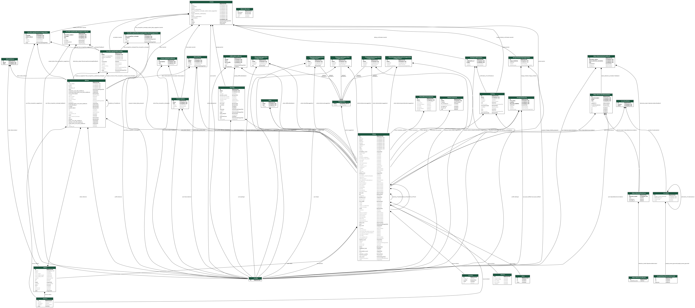

## Ajapaik Analytics
This is the open-sourced Django project code for accessing to [ajapaik.ee](https://ajapaik.ee/) crowdsourced database

## Access rights
For database access & portforwarding etc you need user/password. Ask Zache or Vahur from [Ajapaik slack](http://bit.ly/join-Ajapaik-Slack) for creation.

## Installation

1.) Get source code
```
git clone git@github.com:Ajapaik/ajapaik-analytics.git
cd ajapaik-analytics
```

2.) Create virtualenv for python and activate it
```
python3 -m venv ./venv
source ./venv/bin/activate
```

3.) Install requirements
```
pip install -r requirements.txt
```

3.b) OPTIONAL: OS X only
OS X install seems to require GDAL
- https://medium.com/@vascofernandes_13322/how-to-install-gdal-on-macos-6a76fb5e24a4

4.) Create analytics/settings/local.py
```
cp analytics/settings/local.py.example analytics/settings/local.py
edit analytics/settings/local.py
```

5.) (OPTIONAL) If you are running code locally and not in analytics then create portforward to analytics for database access
```
ssh -L 5430:127.0.0.1:5430 USERNAME@ajapaik.ee -p PORT
```

6.) Test that database connections and models are working
```
python manage.py testmodels
```

File: [analytics/management/commands/testmodels.py](analytics/management/commands/testmodels.py)

## Example

Django documentation for management commands
* https://docs.djangoproject.com/en/4.0/howto/custom-management-commands/

File: [analytics/management/commands/example.py](analytics/management/commands/example.py)

```
from django.core.management.base import BaseCommand, CommandError
from analytics.replica.models_ajapaik import Photo

class Command(BaseCommand):
    help = 'Print coordinates and urls of first 10 photos'

    def handle(self, *args, **options):
        photos = Photo.objects.filter(lat__isnull=False, lon__isnull=False).order_by('id')[:100]
        for photo in photos:
            print(str(photo))
            print('* lat: ' + str(photo.lat) + '\tlon: ' + str(photo.lon))
            print('* IIIF manifest: ' + photo.get_iiif_manifest_url)
            print('* IIIF image server: ' + photo.get_iiif_image_url)
            print('* Thumbnail: ' + photo.get_thumbnail_url)
            print('* Full image (url): ' + photo.get_full_image_url)
            print('* Full image (on analytics disk): ' + photo.get_full_image_path)
            print('')
```

Execute code:
```
python manage.py example
```

Output:
```
Paks Margareeta ja Rannavärav (1699)
* lat: 59.4428383978513 lon: 24.7493648624268
* IIIF manifest: https://ajapaik.ee/photo/1699/v2/manifest.json
* IIIF image server: https://ajapaik.ee/iiif/work/iiif/ajapaik/2011/02/26/af69df6581236498472ccd740e0a4b59.jpg.tif/full/max/0/default.jpg
* Thumbnail: https://ajapaik.ee/photo-thumb/1699/400/
* Full image (url): https://ajapaik.ee/media/uploads/2011/02/26/af69df6581236498472ccd740e0a4b59.jpg
* Full image (on analytics disk): /storage/ajapaik_media/uploads/2011/02/26/af69df6581236498472ccd740e0a4b59.jpg

...
```

## Models
Replicated Ajapaik models in database



For regenerating model map
```
apt-get install graphviz-dev
pip install pygraphviz
./manage.py graph_models --pygraphviz -o ajapaik_replica_models.png
```
